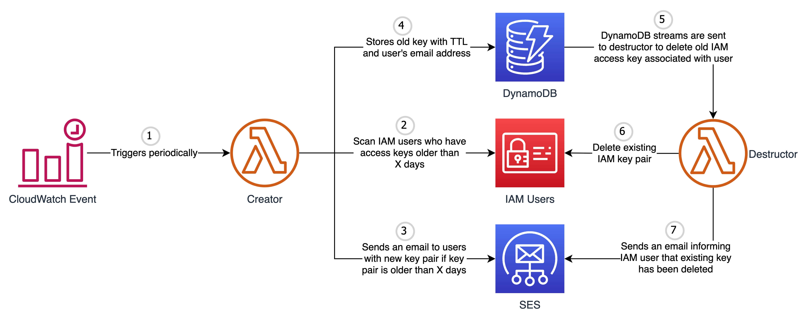

## aws-iam-key-rotator

   

This tool is responsible for generating a new IAM access key pair every X days and mails it to the user via SES. It will also delete the existing key pair after a few days of new key generation to allow the user to update the new key wherever required.

### Prerequisites:
- [Terraform](https://www.terraform.io/downloads.html)
- [AWS CLI](https://aws.amazon.com/cli/)

### AWS Services Involved:
- Lambda
- DynamoDB
- SES
- CloudWatch Event
- IAM

### Process:

- CloudWatch triggers lambda function which checks the age of access key for all IAM users who has **Email**(case-insensitive) tag attached.
- If access key age is greater than `ACCESS_KEY_AGE` environment variable and if the user has ONLY 1 key pair associated a new key pair is generated and the same is mailed to user via AWS SES.
- The existing key is stored in DynamoDB table with user details and an expiration timestamp.
- DynamoDB stream triggers another lambda function which is responsible for deleting the old access key associated to IAM user.
- If it fails to delete the old access key pair the entry is added back to DynamoDB table so that the same can be picked up later for retry.
