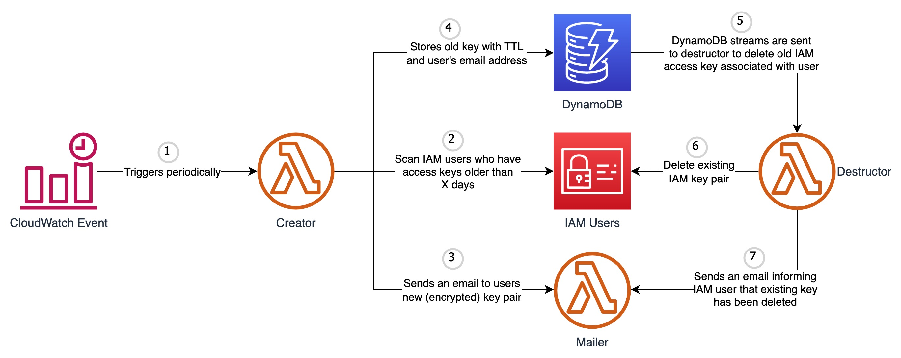

## aws-iam-key-rotator

   

This tool generates a new IAM access key pair every X number of days and informs about the same using the supported mailers mentioned below. Moreover, it will delete the existing key pair once it reaches End-of-Life.

### Prerequisites:
- [Terraform](https://www.terraform.io/downloads.html)
- [AWS CLI](https://aws.amazon.com/cli/)

### AWS Services Involved:
- Lambda
- DynamoDB
- SES
- CloudWatch Event
- IAM

### Supported Mailers:
- AWS SES
- Mailgun
- SMTP

### Logic Flow:

- CloudWatch triggers lambda function which checks the age of access key for all the IAM users who have **IKR:EMAIL**(case-insensitive) tag attached.
- If existing access key age is greater than `ACCESS_KEY_AGE` environment variable or `IKR:ROTATE_AFTER_DAYS` tag associated to the IAM user and if the user ONLY has a single key pair associated a new key pair is generated and the same is mailed to the user via your selected mail service.
- The existing access key is than stored in DynamoDB table with user details and an expiration timestamp.
- DynamoDB stream triggers destructor lambda function which is responsible for deleting the old access key associated to IAM user if the stream event is `delete`.
- In case it fails to delete the existing key pair the entry is added back to the DynamoDB table so that the same can be picked up later for retry.

### Setup:
- Use the [terraform module](terraform) included in this repo to create all the AWS resources required to automate IAM key rotation
- Add following tags to the IAM user whose access keys needs to be automated. All the tags mentioned are case-insensitive:
  - Required:
    - `IKR:EMAIL`: Email address of IAM user where alerts related to access keys will be sent
  - Optional:
    - `IKR:ROTATE_AFTER_DAYS`: After how many days new access key should be generated. **Note:** If you want to control key generation period per user add this tag to the user else environment variable `ROTATE_AFTER_DAYS` will be used
    - `IKR:DELETE_AFTER_DAYS`: After how many days existing access key should be deleted. **Note:** If you want to control key deletion period per user add this tag to the user else environment variable `DELETE_AFTER_DAYS` will be used
    - `IKR:INSTRUCTION_0`: Add help instruction related to updating access key. This instruction will be sent to IAM user whenever a new key pair is generated. **Note:** As AWS restricts [tag value](https://docs.aws.amazon.com/general/latest/gr/aws_tagging.html#tag-conventions) to 256 characters you can use multiple instruction tags by increasing the number (`IKR:INSTRUCTION_0`, `IKR:INSTRUCTION_1` , `IKR:INSTRUCTION_2` and so on). All the instruction tags value will be combined and sent as a single string to the user.

### Helper Script:
- `tag-iam-users.py`: Tags IAM users by reading **iam-user-tags.json** file
